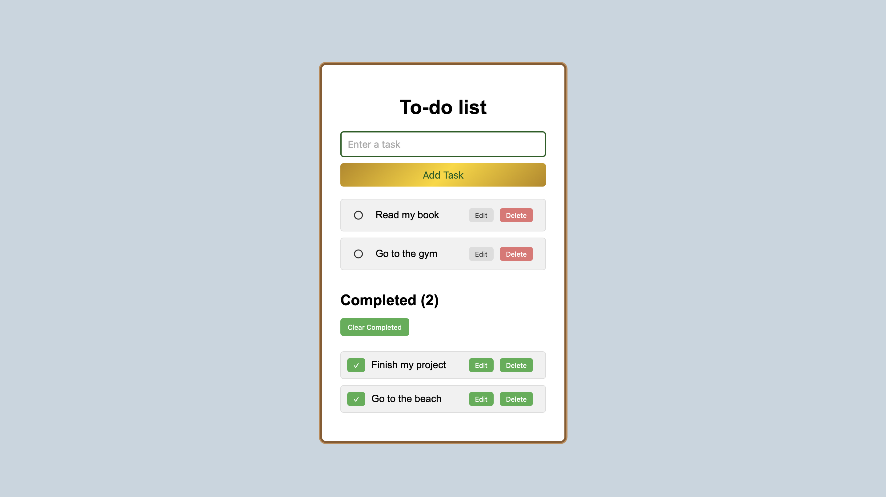

To-do list
A simple and responsive task management application built with HTML, CSS, and JavaScript.
This project allows users to add, edit, delete, and complete tasks. Completed tasks are moved to a separate section, where users can manage and clear them. Tasks are stored in the browser using localStorage, so they remain available after refreshing or reopening the page.
Features
Add tasks — quickly add new tasks to the list.
Edit tasks — update the text of existing tasks.
Delete tasks — remove tasks that are no longer needed.
Complete tasks — mark tasks as completed with the done button.
Completed section — completed tasks are moved to a separate list.
Completed counter — displays the number of completed tasks.
Clear completed — remove all completed tasks at once.
Local storage — tasks are saved in the browser and remain after refreshing the page.
Responsive design — the interface adapts to different screen sizes.
Technologies
HTML5
CSS3
JavaScript
localStorage
How It Works
Users can enter a task in the input field and click Add Task to add it to the active task list.
Each task has controls for completing, editing, and deleting it. When a task is marked as completed, it moves from the active list to the Completed section.
Completed tasks can be removed individually or all at once using the Clear Completed button.
The application uses localStorage to save the task data in the browser. This allows tasks to remain available after the page is refreshed or reopened.
Live Demo
Try the live version of the project:
[View To-do List](https://stanislavhal.github.io/TO-DO-LIST/)
Screenshot

What I Learned
While building this project, I practiced:
Working with the DOM
Handling user events
Creating and updating elements with JavaScript
Working with arrays and objects
Using functions to organize code
Using localStorage to save data
Updating the user interface dynamically
Building a responsive layout with CSS
Author
Stanislav
This project was created as part of my web development portfolio.